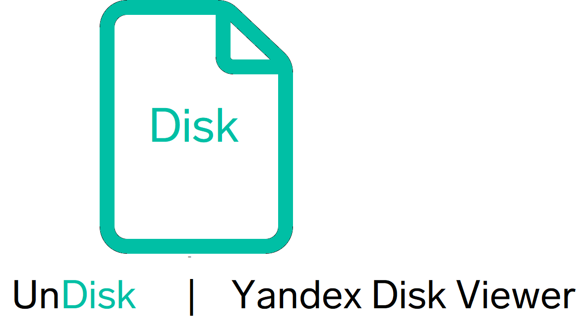

# UnDisk



## Функциональность

UnDisk (или Yandex Disk Viewer) - это веб-приложение на Django, которое позволяет пользователям просматривать и загружать файлы с Яндекс.Диска по публичной ссылке.

Основные функции:
- Просмотр списка файлов по публичной ссылке
- Фильтрация и сортировка файлов
- Поиск файлов
- Предварительный просмотр файлов
- Загрузка выбранных файлов

## Требования

- Python 3.9
- Django
- requests

## Установка

1. Клонируйте репозиторий:

    ```sh
    git clone https://github.com/anxnas/yandex_disk_viewer.git
    cd yandex_disk_viewer
    ```

2. Создайте и активируйте виртуальное окружение:

    ```sh
    python -m venv venv
    source venv/bin/activate  # Для Windows: venv\Scripts\activate
    ```

3. Установите зависимости:

    ```sh
    pip install -r requirements.txt
    ```

## Запуск

1. Выполните миграции:

    ```sh
    python manage.py migrate
    ```

2. Запустите сервер:

    ```sh
    python manage.py runserver
    ```

3. Откройте браузер и перейдите по адресу `http://127.0.0.1:8000`.

## Докер

Для запуска проекта с использованием Docker:

1. Постройте и запустите контейнеры:

    ```sh
    docker-compose up --build
    ```

2. Откройте браузер и перейдите по адресу `http://127.0.0.1:8000`.

## Тестирование

Для запуска тестов используйте следующую команду:

    ```sh
    python manage.py test
    ```


## Инструкция по использованию

1. Перейдите на главную страницу.
2. Введите публичный ключ в поле "Public key".
3. Нажмите кнопку "Открыть".
4. Просмотрите список файлов.
5. Откройте файл для просмотра.
6. Нажмите кнопку "Скачать", чтобы сохранить файл на компьютер.
7. Отметьте файлы, удержав одну из иконок файлов.
8. Нажмите кнопку "Скачать выбранные".

Подробная инструкция доступна по [этой ссылке](https://anxnas.github.io/yandex_disk_viewer/usage.html)

## Документация

Полная документация доступна по [этой ссылке](https://anxnas.github.io/yandex_disk_viewer/).

## Лицензия

Этот проект лицензирован под лицензией MIT. Подробности см. в файле [LICENSE](LICENSE).

## Автор

Сделано с ❤️ anxnas (Хренов Святослав)
